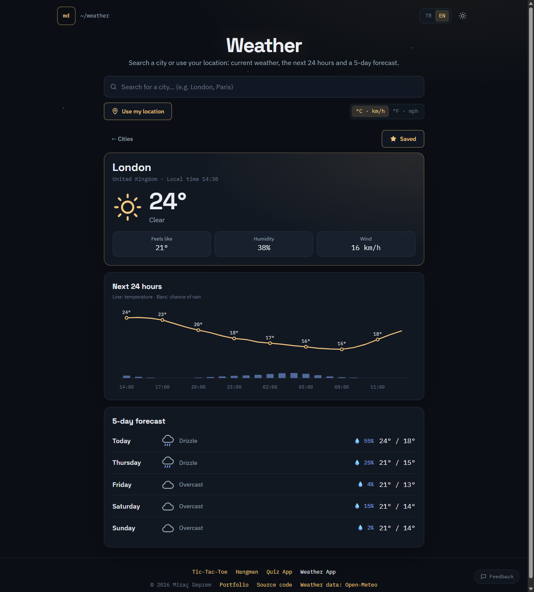
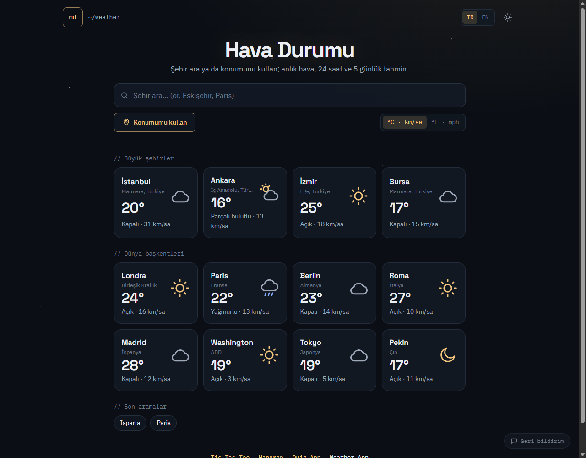
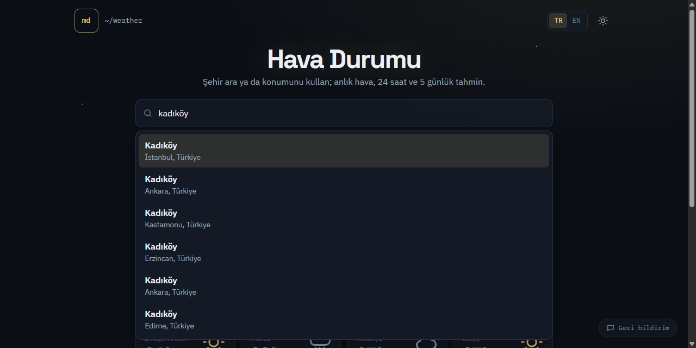
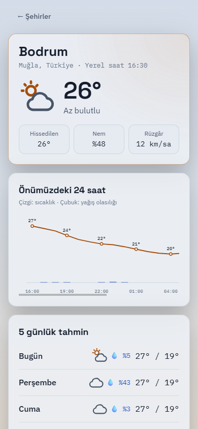

# Weather App

**English** | [Türkçe](README.tr.md)

A weather app in plain HTML, CSS and JavaScript. Search any city or district, or use your location, to see the current weather, a 24-hour chart and a 5-day forecast. It needs no API key and no server.

**Live demo:** [weather.miracdeprem.com](https://weather.miracdeprem.com)



## Features

- **Home screen at a glance:** İstanbul, Ankara, İzmir and Bursa, plus eight world capitals: London, Paris, Berlin, Rome, Madrid, Washington, Tokyo and Beijing. Each card shows the temperature, conditions and wind. All cities load in a single request.
- **Search that understands Turkish:**
  - Results come from two open sources at the same time:
    - OpenStreetMap for provinces, districts and neighbourhoods in Türkiye.
    - GeoNames for cities around the world.
  - "ısparta", "sanliurfa" and "kadikoy" find the right place.
  - Foreign cities can be searched by their Turkish names, such as "londra" or "moskova".
  - The faster source shows its results immediately, and the list updates when the other one answers.
  - Suggestions can be picked with ↑/↓ and Enter.
- **Use my location (optional):**
  - Shows the weather where you are, with the real place name, such as "Kadıköy · İstanbul, Türkiye".
  - If you deny permission, a short notice explains it and search keeps working.
  - Your location is never stored.
- **City details:**
  - Current temperature, feels like, humidity and wind.
  - A 24-hour chart of temperature and chance of rain, drawn in SVG without a library.
  - A 5-day forecast.
  - The place's local time.
  - Night-time icons.
- **An address for every city:** each of Türkiye's 81 provinces and the world capitals has its own page, such as [weather.miracdeprem.com/istanbul](https://weather.miracdeprem.com/istanbul), in Turkish and English (`?lang=en`).
- **Saved cities and recent searches**, kept in your browser.
- **One unit switch:** °C and km/h, or °F and mph. It updates every screen instantly, without a new request.
- **Turkish and English**, and a dark and a light theme matching [my portfolio](https://www.miracdeprem.com).
- **Feedback:** a small button opens a form (name optional, email or phone, message) that sends straight to me through my portfolio site.
- **Accessible:** the search box is a proper combobox for screen readers, the chart has a text summary, and it works on phones.

## Screenshots

| Home: major cities and world capitals | Search in Turkish | On a phone: my location, light theme |
|---|---|---|
|  |  |  |

## Tech Stack

- HTML, CSS, JavaScript (ES modules, no framework, no build step)
- [Open-Meteo](https://open-meteo.com): forecasts and world city search (GeoNames)
- [Photon](https://photon.komoot.io) by komoot: search in Türkiye (OpenStreetMap)
- [BigDataCloud](https://www.bigdatacloud.com/free-api/free-reverse-geocode-to-city-api): the name of your location
- `node --test`: 44 unit tests
- Vercel, with a strict Content Security Policy
- **No API keys and no npm dependencies**

## Installation

Open [weather.miracdeprem.com](https://weather.miracdeprem.com), or run it locally (Node.js 20 or newer):

```bash
git clone https://github.com/MrcDprm/weather-app.git
cd weather-app
npm run dev
```

Then open `http://localhost:5174`. The small development server also sends the same security headers as the live site, so anything the CSP would block shows up locally too.

Run the tests with:

```bash
npm test
```

### Project structure

```
app.html, styles.css      Page template and styles
api/page.js               Serves every address (/, /istanbul, /londra …) with its own title, description and structured data
lib/                      <head> builder and sitemap for the page function
src/routes.js             Addresses: 81 provinces and 8 world capitals
src/provinces.js          Coordinates and regions of Türkiye's 81 provinces
src/weather.js            Turns forecast responses into simple objects; weather codes, unit conversion
src/places.js             Built-in cities, search results from both sources, merging and ranking
src/storage.js            Settings, saved cities and recent searches, validated on every read
src/api.js                Requests to Open-Meteo, Photon and BigDataCloud with timeouts
src/chart.js              The 24-hour SVG chart
src/icons.js              Weather icons drawn as SVG paths
src/main.js               Screens, search, location, language, units and theme
scripts/dev-server.mjs    Local server with the same headers and rewrites as vercel.json
tests/                    Unit tests
```

### Privacy

- There is no server of my own. Your browser talks directly to the weather and search services.
- When you use your location, the coordinates (rounded to about 10 metres) are sent to Open-Meteo for the forecast and to BigDataCloud for the place name. They are not saved anywhere.
- Settings, saved cities and recent searches stay in your browser's local storage.

## What I Learned

- **Never trusting data from outside.** Every response is checked before it reaches the screen. A missing number becomes "—", a broken row is skipped, and unknown fields are dropped. The same checks run on what I read back from local storage, because it can be edited by hand.
- **Combining two imperfect sources.** One place database could not handle the Turkish "ı" and missed Kadıköy in İstanbul, while the other could not find "London" when typed in Turkish. I query both at once. I fold Turkish letters so "sanliurfa" matches "Şanlıurfa", drop fuzzy matches, rank capitals first and remove duplicates by name and distance.
- **Not letting slow answers win.** Search waits 300 ms after the last key press. Each request carries a number, so an old answer that arrives late cannot overwrite a newer one. The fast source is shown right away instead of waiting for the slow one.
- **Drawing a chart by hand.** The chart is a few SVG lines and rectangles. The maths is in a separate function, so I could test it: the warmest hour sits at the top, equal temperatures do not divide by zero, and missing rain draws no bar.
- **Time zones.** Forecast times come in the city's local time, and dates like "2026-10-01" can slip to the previous day if parsed as midnight. Reading them at noon UTC keeps the weekday right.
- **Security headers for a static site.** The CSP allows connections only to the services I use, and location access is allowed only for this site. The local development server sends the same headers, so a blocked request shows up before it reaches the live site.

## Future Plans

- Sunrise and sunset, UV index and air quality.
- Hourly details for the other days.
- Weather alerts.
- An installable app (PWA) that works offline with the last forecast.

## Credits

- Weather data and world city search: [Open-Meteo](https://open-meteo.com) (CC BY 4.0), which uses [GeoNames](https://www.geonames.org) (CC BY 4.0).
- Search in Türkiye: [Photon](https://photon.komoot.io) by komoot, with data © [OpenStreetMap contributors](https://www.openstreetmap.org/copyright) (ODbL).
- Location names: [BigDataCloud](https://www.bigdatacloud.com) free reverse geocoding.

## License

[MIT](LICENSE)
